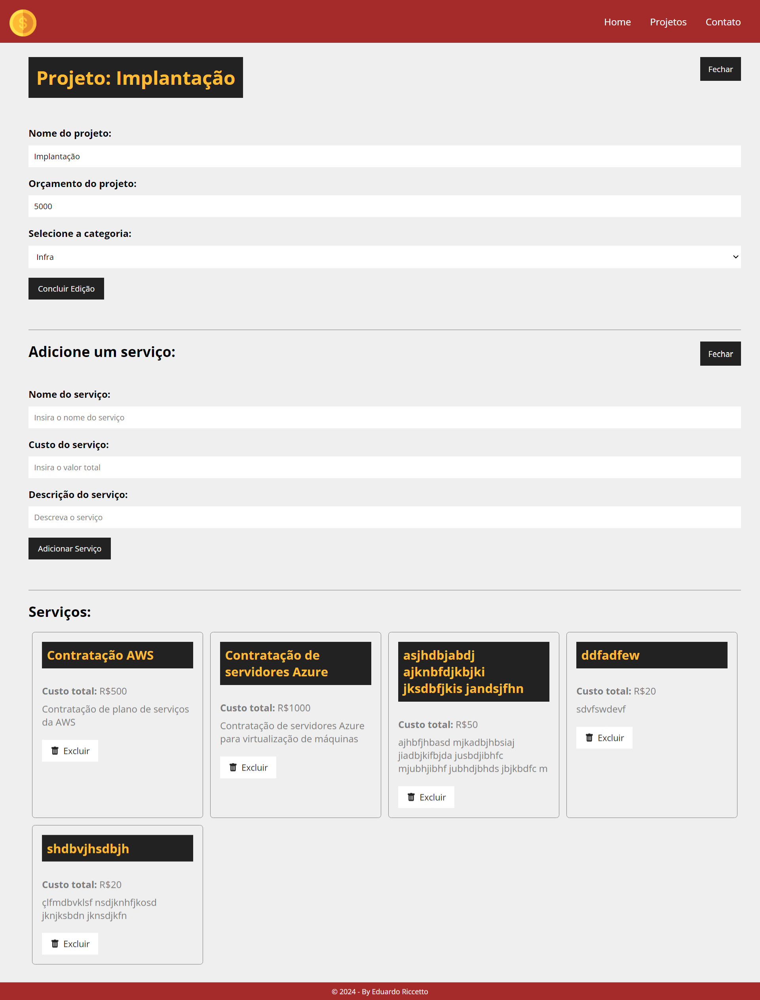

Clique aqui para alterar o idioma:

 

# Management

O projeto **Management** é uma aplicação de gerenciamento de projetos desenvolvida em React como parte do curso A Hora de Codar ministrado por Matheus Battist. Incorporando desde conceitos básicos até técnicas avançadas do React, como o uso de hooks, roteamento e integração com APIs, o projeto oferece aos alunos uma oportunidade prática e abrangente de aplicar conhecimentos adquiridos, capacitando-os para projetos futuros e desafios profissionais. Além disso, possui um layout responsivo para dispositivos móveis e, para uma experiência completa com o backend ativo, é necessário acessar o repositório e executá-lo localmente em sua própria máquina.

 

:computer: [Clique aqui para acessar a aplicação](https://projects-five-alpha.vercel.app/)

 

 

## Tecnologias

 

## Dependencias:

- json-server;
- react;
- react-dom;
- react-icons;
- react-router-dom;
- react-scripts;
- util;
- uuid;

## Começando

Este projeto pode ser usado em sua própria máquina após realizar um **PUSH** deste repositório.

### `npm install`

Para baixar e atualizar todas as bibliotecas e dependências do projeto

### `npm run backend`

Para subir a api node do projeto

### `npm start`

Executa aplicativo em modo desenvolvimento.\
Abra [http://localhost:3000/](http://localhost:3000/) para vizualizá-lo em seu navegador.

A pagina será recarregada quando você fizer alterações.\
Você também pode ver quaisquer erros de lint no console.

## Contato

  
   
  
   

